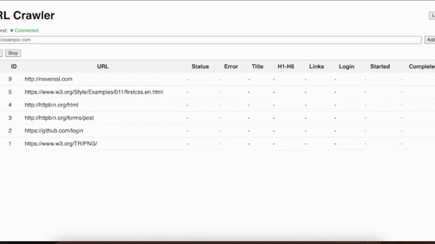

# URL Crawler

Backend (Go) + MySQL + Frontend (React/TS) to crawl a URL and extract metadata.

## Demo




## Backend

### Prerequisites
- Go 1.25+
- MySQL 8.4.44+

### Configuration (env)
- DB_HOST (default: 127.0.0.1)
- DB_PORT (default: 3306)
- DB_USER (default: root)
- DB_PASSWORD (default: root)
- DB_NAME (default: url_crawler)
- API_PORT (default: 8080)
- JWT_SECRET (default: dev-secret-change)
- ADMIN_USERNAME (default: admin)
- ADMIN_PASSWORD (default: password)

### Docker Compose (dev)
```
docker compose up --build
```

### Testing

**Unit Tests:**
```bash
cd backend
go test ./...
```

**E2E Tests (against real URLs):**
```bash
cd backend
E2E_TEST=1 go test -tags=e2e ./internal/crawler
```

E2E tests use real URLs: `example.com` (minimal), `httpbin.org/html` (simple HTML content), `info.cern.ch` (legacy), `w3.org` examples (headings/links), `httpbin.org/forms/post` (forms), `github.com/login` (login form), `w3.org/TR/PNG/` (many links), and `httpstat.us` (404/500 errors).

### Test coverage checklist (per requirements)
- **HTML version**: unit + e2e
- **Page title**: unit + e2e
- **Heading counts (H1–H6)**: unit (all levels) + e2e (H1–H3 on key pages)
- **Internal vs external links**: unit + e2e
- **Inaccessible links (4xx/5xx)**: unit only (httptest server)
- **Login form presence**: unit (+) and e2e (+ on `https://github.com/login`)

### Worker Pool & Concurrent Execution
The backend uses a worker pool pattern to process crawl jobs concurrently:
- **10 concurrent workers** process jobs in parallel by default
- Jobs are queued in a buffered channel (capacity: 100) for asynchronous processing
- When a job is started via the API, it's immediately enqueued and processed by an available worker
- Workers handle job status updates, crawling, and result persistence independently
- The system supports graceful shutdown, ensuring all in-flight jobs complete before termination
- This design allows the system to handle multiple crawl requests simultaneously while maintaining controlled concurrency

## Test URLs

Here are simple, stable HTML pages good for testing:

- Example domains (very minimal):
  - [http://example.com](http://example.com)
  - [http://example.org](http://example.org)
  - [http://example.net](http://example.net)
- Plain HTML with a title and H1:
  - [http://httpbin.org/html](http://httpbin.org/html)
- Old‑school plain page (links + headings):
  - [https://info.cern.ch/hypertext/WWW/TheProject.html](https://info.cern.ch/hypertext/WWW/TheProject.html)
- Plain page without HTTPS (good for external/external link detection):
  - [http://neverssl.com](http://neverssl.com)
- W3C simple example page (headings, links):
  - [https://www.w3.org/Style/Examples/011/firstcss.en.html](https://www.w3.org/Style/Examples/011/firstcss.en.html)
- Simple form page (to detect login/forms):
  - [http://httpbin.org/forms/post](http://httpbin.org/forms/post)
- Page with many anchor links (good for link counting):
  - [https://www.w3.org/TR/PNG/](https://www.w3.org/TR/PNG/)
- Intentional error pages (for inaccessible link handling):
  - [https://httpstat.us/404](https://httpstat.us/404)
  - [https://httpstat.us/500](https://httpstat.us/500)

Tip: If you need a guaranteed “broken” link on‑page, test with httpbin’s HTML and add a custom URL containing a dead link in your dataset, or host a tiny HTML file via `file://` or a local server with a link to a nonexistent path.